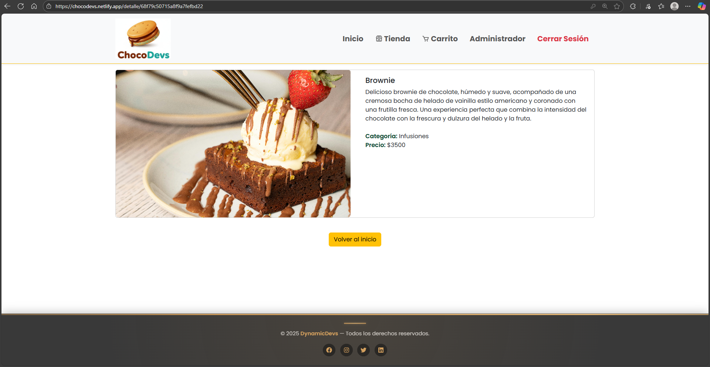
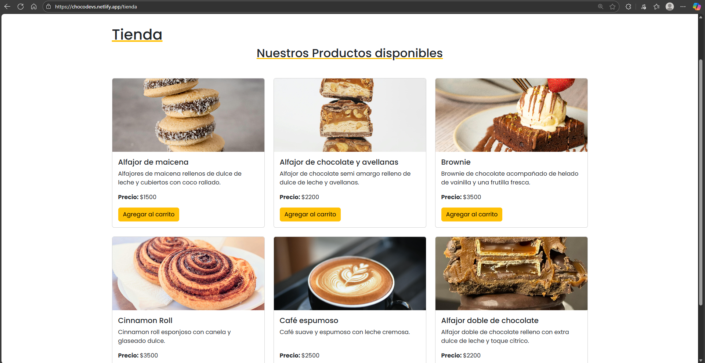
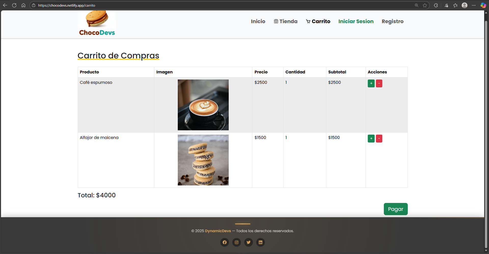
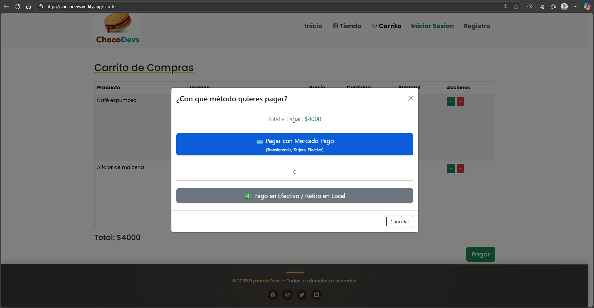
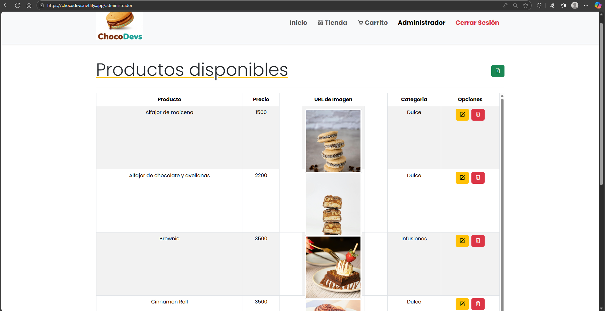
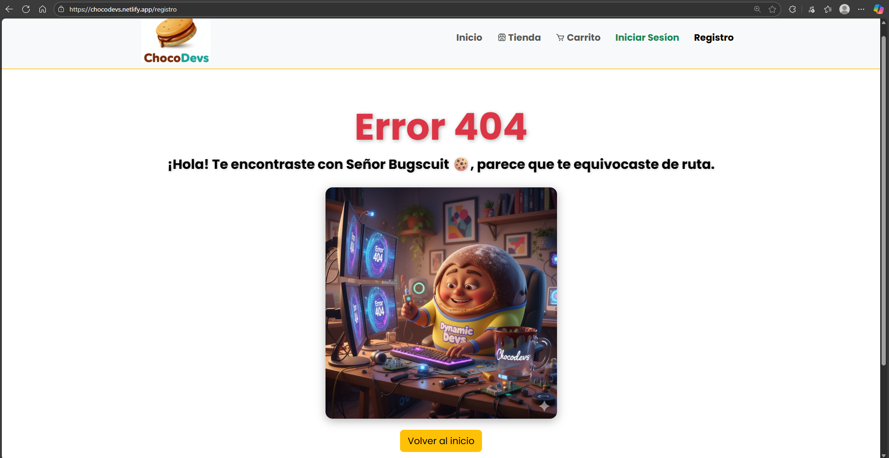

# 🍫 ChocoDevs – E-commerce de Alfajores e Infusiones

**ChocoDevs** es un **proyecto de e-commerce** desarrollado como trabajo académico universitario, con un enfoque completamente profesional.  
Permite gestionar productos (alta, baja y edición) y realizar compras mediante una pasarela de pagos (**Mercado Pago**) o con **pago en efectivo** para retirar en el local.  

Además, el sistema envía **notificaciones automáticas por correo electrónico** al vendedor cuando se concreta una compra —ya sea online o en efectivo— utilizando **Nodemailer**, garantizando una comunicación inmediata y efectiva.  

El proyecto combina buenas prácticas de desarrollo web, experiencia de usuario y gestión de datos, siendo un excelente ejemplo de un **CRUD full stack aplicado**, adaptable a cualquier negocio de productos físicos.

---

---

## 🖼️ Vista previa del proyecto

  
   
  <em>Página principal con catálogo destacado</em>

  
   
  <em>Detalle individual del producto disponible</em>

  
   
  <em>Pagina de la tienda</em>

  
   
  <em>Pagina del carrito</em>

  
   
  <em>Metodo de pago</em>

  
   
  <em>Panel del administrador donde se pueden **crear, editar y eliminar productos** del catálogo, gestionar pedidos y mantener actualizado el inventario.</em>

  
   
  <em>Interfaz mostrada cuando el usuario ingresa a una ruta inexistente.</em>

---

## 🧠 Objetivos del proyecto

- Desarrollar una **tienda online funcional** para la venta de productos de consumo, como alfajores e infusiones.  
- Implementar un **CRUD completo de productos** (alta, baja, modificación y visualización).  
- Crear un **frontend interactivo, moderno y responsivo** utilizando **React** y **Bootstrap**.  
- Integrar una **pasarela de pagos segura** con **Mercado Pago**, junto con la opción de **pago en efectivo** para retiro en el local.  
- Aplicar **buenas prácticas de desarrollo web**, incluyendo estructura modular, componentes reutilizables y manejo de estados globales.  
- Preparar la base del proyecto para que sea fácilmente **escalable y adaptable a cualquier tipo de negocio**.  

---

## 📈 Alcance del proyecto

El proyecto **ChocoDevs** abarca tanto el **frontend** como el **backend**, cubriendo todo el flujo de compra y gestión de productos en una tienda online.  

### 🔹 Funcionalidades implementadas

#### 🛍️ Frontend
- Catálogo dinámico de productos con imágenes, precios y descripciones.  
- Sistema de carrito de compras persistente con **localStorage**.  
- Integración con **Mercado Pago** para pagos online seguros.  
- Opción de **pago en efectivo** con retiro en el local.  
- Confirmaciones visuales de compra y manejo de errores de pago.  
- Interfaz **responsiva** y amigable, desarrollada con **React** y **Bootstrap**.  

#### ⚙️ Backend
- API RESTful construida con **Node.js**, **Express** y **MongoDB**.  
- **CRUD completo de productos**: creación, lectura, actualización y eliminación.  
- Implementación de **Nodemailer** para notificar al vendedor por correo electrónico cuando se realiza una compra (tanto online como en efectivo).  
- Gestión de usuarios y autenticación con **JWT**.  
- Configuración de variables de entorno para mayor seguridad.  

#### 🧩 Integraciones
- **Mercado Pago SDK** para generación de preferencias y pagos en línea.  
- **Nodemailer** conectado a una cuenta de Gmail para el envío automático de notificaciones.  

### 🚀 Futuras mejoras
- Panel administrativo con estadísticas de ventas.  
- Sistema de roles (admin / cliente).  
- Integración con almacenamiento en la nube para imágenes.  
- Notificaciones en tiempo real con WebSockets o Firebase.  

---

💡 En conjunto, **ChocoDevs** demuestra la integración completa de un sistema **Full Stack funcional**, con comunicación fluida entre cliente, servidor y servicios externos.

---

## 🚀 Deploys

- **Frontend:** [https://chocodevs.netlify.app](https://chocodevs.netlify.app)  
- **Backend:** [https://dynamic-devs-proyecto-integrador-cu.vercel.app](https://dynamic-devs-proyecto-integrador-cu.vercel.app)

---

## 👨‍💻 Equipo de desarrollo

| Rol | Nombre | GitHub |
|-----|--------|--------|
| Líder Técnico (Frontend) |  [Cristian Díaz](https://github.com/cristiandcode) | Frontend, React, UI/UX, Backend local |
| Programador |  [Jose Villalba](https://github.com/JosechoVBA) | Frontend, UI/UX, Testing y QA |
| Programador |  [Noelia Cruz](https://github.com/noeliacruz22) | Frontend, UI/UX, Testing y QA |
| Programador |  [Pablo Mateos](https://github.com/PabloMateos19) | Frontend, UI/UX, Testing y QA |
| Programador |  [Matias Gomez]() | Frontend, UI/UX, Testing y QA |

---
## ⚙️ Tecnologías utilizadas

### 🖥️ Frontend

| Tecnología | Versión | Uso |
|-------------|----------|-----|
| **React** | 19.1.1 | Creación de interfaces interactivas y dinámicas |
| **Vite** | 7.1.2 | Herramienta de desarrollo rápida y moderna |
| **React Router DOM** | 7.9.2 | Navegación entre vistas |
| **React Hook Form** | 7.63.0 | Manejo eficiente de formularios |
| **Bootstrap** | 5.3.8 | Diseño responsivo y sistema de grillas |
| **React Bootstrap** | 2.10.10 | Componentes UI reutilizables |
| **Bootstrap Icons** | 1.13.1 | Íconos vectoriales integrables |
| **React Icons** | 5.5.0 | Conjunto adicional de íconos personalizables |
| **SweetAlert2** | 11.23.0 | Alertas modernas y personalizadas |
| **@mercadopago/sdk-react** | 1.0.6 | Integración de pasarela de pagos Mercado Pago |
| **JSON Server** | 1.0.0-beta.3 | Simulación de API local para pruebas |

---

### 🗄️ Backend

| Tecnología | Versión | Uso |
|-------------|----------|-----|
| **Node.js** | 20.x | Entorno de ejecución del servidor |
| **Express.js** | 5.1.0 | Framework para construir API REST |
| **Mongoose** | 8.19.1 | Modelado de datos con MongoDB |
| **MongoDB Atlas** | — | Base de datos NoSQL en la nube |
| **dotenv** | 17.2.3 | Manejo de variables de entorno |
| **cors** | 2.8.5 | Control de acceso entre dominios |
| **morgan** | 1.10.1 | Registro de peticiones HTTP |
| **bcrypt** | 6.0.0 | Hashing seguro de contraseñas |
| **jsonwebtoken (JWT)** | 9.0.2 | Autenticación basada en tokens |
| **express-validator** | 7.2.1 | Validación de datos en endpoints |
| **Nodemailer** | 7.0.10 | Envío de correos automáticos al recibir pedidos |
| **Mercado Pago SDK (Node)** | 2.9.0 | Generación de preferencias y pagos online |

---

### 💳 Pasarela de pagos

| Plataforma | Uso |
|-------------|-----|
| **Mercado Pago** | Pagos online con tarjeta, transferencia o efectivo |
| **Pago en efectivo** | Opción local con retiro en el negocio |

---

### 🧰 Entorno y herramientas

| Herramienta | Uso |
|-------------|-----|
| **Visual Studio Code** | Editor principal de desarrollo |
| **Git & GitHub** | Control de versiones y repositorio |
| **Vercel** | Deploy del backend |
| **Netlify** | Deploy del frontend |

---

📦 El stack completo combina **React + Node.js + MongoDB**, garantizando una arquitectura **Full Stack moderna**, escalable y orientada a la experiencia del usuario.

---

## 🧩 Funcionalidades principales

- 🛠️ **CRUD completo de productos:** alta, baja, modificación y validación de datos.  
- 🛍️ **Visualización del catálogo:** listado dinámico con detalles individuales de cada producto.  
- 🛒 **Carrito de compras interactivo:** permite agregar, eliminar y actualizar productos en tiempo real.  
- 💳 **Integración con pasarela de pagos (Mercado Pago):** procesamiento seguro de compras online.  
- 💵 **Opción de pago en efectivo:** con retiro en el local para clientes presenciales.  
- ✉️ **Notificación automática por correo electrónico:** el vendedor recibe un mail con el detalle de cada compra realizada, ya sea online o en efectivo (**implementado con Nodemailer**).  
- 📱 **Diseño responsivo y adaptable:** optimizado para dispositivos móviles, tablets y desktop.  
- 🔗 **Comunicación full stack:** sincronización entre frontend (**React**) y backend (**Node.js + Express + MongoDB Atlas**).  
- ⚙️ **Gestión de errores y validaciones:** manejo robusto de excepciones tanto en frontend como en backend.  
 

---

## 👨‍💻 Responsable del Proyecto

**Cristian Díaz**  
*Líder Técnico Full Stack – Arquitectura Frontend & Backend*  

Desarrollador con sólida experiencia en la creación de aplicaciones web modernas y escalables.  
Responsable de la **planificación, estructura, desarrollo e integración técnica** del proyecto, abarcando tanto el **Frontend (React, Vite, Bootstrap)** como el **Backend (Node.js, Express, MongoDB / Mongo Atlas)**.  
Su enfoque se centra en la optimización del rendimiento, la calidad del código, la seguridad de los datos y las buenas prácticas de desarrollo ágil.  

### 🤝 Equipo de desarrollo
**DynamicDevs** – Grupo colaborativo de desarrolladores enfocados en el aprendizaje, la mejora continua y la aplicación de metodologías ágiles en proyectos full stack.  

### 📫 Contacto  
- 💼 [LinkedIn](https://www.linkedin.com/in/cristiandcode/)  
- 💻 [GitHub](https://github.com/cristiandcode)  
- ✉️ **Correo:** diazcristian0210@gmail.com

---
## 🚀 Clonar y ejecutar el proyecto

1️⃣ **Clonar el repositorio**  
Dirigirse a la terminal y hacer el clone 
git clone https://github.com/PowerSystem2024/DynamicDevs_ProyectoIntegrador_CuartoSemestre_Front.git

2️⃣ **Entrar en el directorio del proyecto**  
cd DynamicDevs_ProyectoIntegrador_CuartoSemestre_Front

**3️⃣ Instalar dependencias**
npm install

**4️⃣ Ejecutar el proyecto en modo desarrollo**  
npm run dev

**5️⃣ Construir el proyecto para producción**  
npm run build

## 🙌 Agradecimientos

Agradecemos a la **Universidad Tecnológica Nacional Mendoza – FRSR** por el constante acompañamiento académico y por brindar los recursos necesarios para el desarrollo de este proyecto integrador.  
Queremos reconocer especialmente al **docente Ariel Betancud** por su guía, apoyo y valiosas sugerencias durante todo el proceso.

